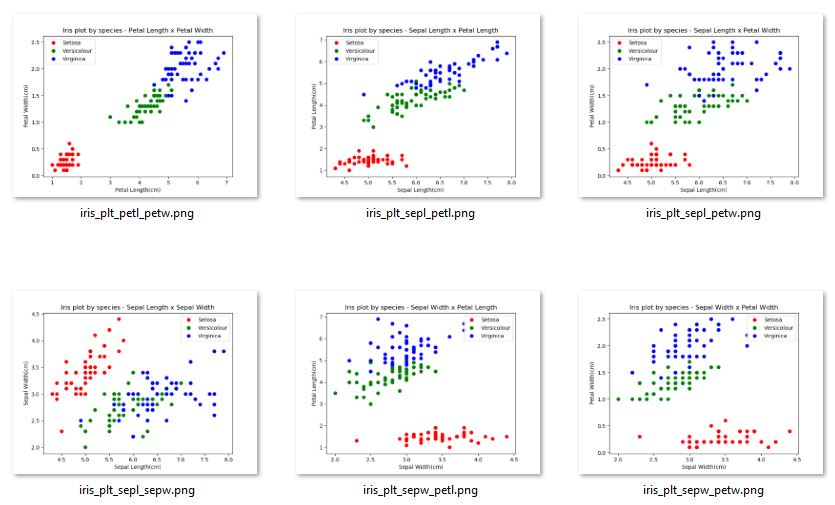

<!-- https://guides.github.com/features/mastering-markdown/ -->
# 52167-Project
GMIT Programming and scripting project 2018

[Project description document](doc/GMIT_Project_Description.pdf)

## To be completed

- [x] Research background information about the data set and write a summary about it.
- [ ] Keep a list of references you used in completing the project.
- [X] Download the data set and write some Python code to investigate it.
- [ ] Summarise the data set by, for example, calculating the maximum, minimum and mean of each column of the data set. A Python script will quickly do this for you.
- [ ] Write a summary of your investigations.
- [ ] Include supporting tables and graphics as you deem necessary.

## Background information on the Iris Dataset

There seems to be vast amounts of information on the topic(About 5,230,000 results on google) of the iris dataset and several studies and papers derived around the subject and used as examples to explain statistics and statistical analyses of datasets.

The raw dataset is available from various sources online but the main set for this excercise was obtained from University of California's Machine Learning repositort cited in the list of references below.

The dataset consists of 150 instances of three classes with 4 attributes for every class.

Attribute Information:
1. sepal length in cm
1. sepal width in cm
1. petal length in cm
1. petal width in cm
1. class: 
   1. Iris Setosa
   1. Iris Versicolour
   1. Iris Virginica

In order to be effective in deriving a meaning conclusion or perform any kind of analyses on the data, one needs to clarify the values recorded in the set, so basically understand what sepal and a petal is.

So a petal is the obvious that most of us know from regual flowers and the sepal is the more rgid typically stem coloured part of the flower supporting the petals. In Iris flowers this is more confusing as sepals tends to look like petals being a similar colour, however they would be behind petals performing the function of sepals.

## Investigating the dataset
### Graphing the data

A Matlab paper published by D Peters(referenced) suggested normalising the datasets for improved results.

Samples from this process yielded the following:

Original set - floated and transposed
[ 5.1  4.9  4.7  4.6  5. ]
[ 3.5  3.   3.2  3.1  3.6]
subrtact mean of subsets by species
[ 0.094 -0.106 -0.306 -0.406 -0.006]
[ 0.082 -0.418 -0.218 -0.318  0.182]
normalise the entire set
[ 0.01506051 -0.01698312 -0.04902675 -0.06504857 -0.00096131]
[ 0.01986748 -0.10127569 -0.05281842 -0.07704706  0.04409611]

The result of the normalisation process eliminated all the seperations in the sets. Another idea was calculating the products of the length and width results in order to evaluate seperation, however no better results were produced as seen in the single set paramaters.

The next stage was to produce all the posisble scatter plots colour coded by species. This yielded the most satisfactory results and created a reanably good seperation on most plots.

See the [plots folder](plots/) for full size samples.

The best sets were produced by:
* Sepal Lengt x Sepal Widt with a 96% seperation in the overlapping species
* Sepal Length x Petal width with a 94% seperation in the overlapping species

### Analysing the datasets

Skewness is a measure of symmetry, or more precisely, the lack of symmetry. A distribution, or data set, is symmetric if it looks the same to the left and right of the center point. 

Kurtosis is a measure of whether the data are heavy-tailed or light-tailed relative to a normal distribution. That is, data sets with high kurtosis tend to have heavy tails, or outliers. Data sets with low kurtosis tend to have light tails, or lack of outliers. A uniform distribution would be the extreme case. 

## List of references
1. [Wikipedia - Iris flower data set](https://en.wikipedia.org/wiki/Iris_flower_data_set)
1. [Iris Setosa - classification details](https://alchetron.com/Iris-setosa)
1. [Sir Ronal Fisher - British statistition and genetecist](https://en.wikipedia.org/wiki/Ronald_Fisher)
1. [Iris data set](https://archive.ics.uci.edu/ml/datasets/iris) from the UCI Machine Learning Repository. Irvine, CA: University of California, School of Information and Computer Science.
1. [Example for Principal Component Analysis (PCA): Iris data](https://www.math.umd.edu/~petersd/666/html/iris_pca.html)